### Hi, I’m [War](https://warsa.me) 👋

- 👋 Web dev with 7+ years experience
- ⚡ Love building tools that simplify tasks
- 📦 Working on TypeScript libraries and open-source projects  
- 🛠️ Mostly use TypeScript, Bun/Node.js, and Flutter  

---

### Languages
[][website]
[][website]
[][website]
[][website]
[][website]
[][website]
[][website]

 
 
 

### Backend and Tools
[][website]
[][website]
[][website]
[][website]
[][website]
[][website]
[][website]
[][website]
[][website]

 
 
 

---

[website]: https://warsa.me
